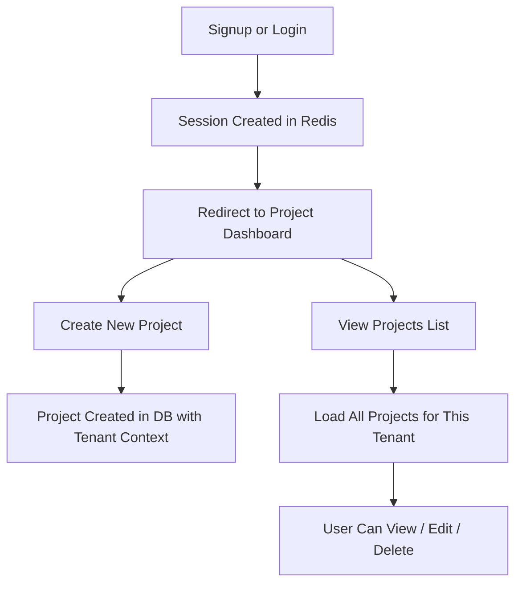

# User Journey

This document shows a typical user journey in the application, from account creation to project management — all scoped within a tenant context.

---

## User Types

| Role   | Description                               |
|--------|-------------------------------------------|
| Admin  | Manages tenant settings, invites users, creates projects |
| Member | Limited access; can view and manage projects if permitted |

---

## Journey Flow



---

## Authentication Flow

1. User visits login page
2. Enters email and password
3. Credentials are verified:
   - User found by email + tenant ID
   - Password hash is checked
4. On success:
   - A secure session token is created
   - Token is stored in Redis with tenant + user metadata
   - Token is used by client in Authorization Header as bearer token

---

## Authorization & Access Control

- All routes are protected by middleware that checks:
  - Session validity (via Redis)
  - User's tenant context
  - Required role (admin vs member)

- Users cannot access resources outside their tenant.

---

## Project Creation

1. Admin clicks "Create Project"
2. Enters project name
3. Request is sent to /projects with user's session token
4. Server:
   - Verifies session and extracts tenant_id and user_id
   - Creates the project with CreatedBy = user_id and TenantID = tenant_id
5. Project appears in the tenant's dashboard immediately

---

## Returning User Flow

```
- User returns to app  
- Existing session token found in cookie  
- Token validated via Redis  
- User + tenant context restored  
- Redirected to dashboard

```

## Summary

| Step            | Handled By        | Notes                            |
| --------------- | ----------------- | -------------------------------- |
| Signup/Login    | Auth handler      | Stores session in Redis          |
| Auth check      | Middleware        | Injects tenant/user into context |
| Project actions | Usecase + Handler | Always scoped to `tenant_id`     |
| Logout          | Session handler   | Deletes token from Redis         | 